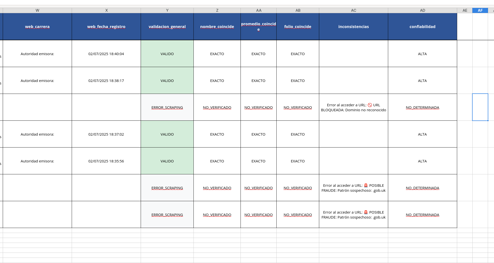

# 🔍 QR Certificate Validator

Sistema automatizado para extraer y validar códigos QR de certificados PDF con análisis de seguridad integrado.

[](https://python.org)
[](LICENSE)
[](#security)

## 🚀 Características

### 📄 Procesamiento de PDFs

- **Extracción automática** de códigos QR desde certificados PDF
- **Multi-algoritmo** de detección (OpenCV, pyzbar)
- **Procesamiento por lotes** de múltiples archivos
- **Análisis de seguridad** integrado para detectar PDFs maliciosos

### 🔐 Validación Online

- **Verificación en tiempo real** a través de web scraping
- **Comparación automática** entre datos QR y sitio web
- **Detección de inconsistencias** y posibles falsificaciones
- **Protección SSRF** con validación de dominios

### 📊 Reportes Profesionales

- **Excel con formato avanzado** (múltiples hojas, colores condicionales)
- **Exportación CSV/JSON** para integración con otros sistemas
- **Estadísticas detalladas** de validación y confiabilidad
- **Logs estructurados** para auditoría

### 🛡️ Seguridad

- **Análisis de malware** en PDFs (JavaScript, archivos embebidos)
- **Validación de rutas** para prevenir path traversal
- **Sanitización de URLs** y prevención SSRF
- **Logging de eventos** de seguridad

## 📋 Requisitos

- **Python 3.8+**
- **Linux/macOS** (probado en Fedora)
- **Chrome/Chromium** para web scraping
- **Dependencias**: Ver [requirements.txt](requirements.txt)

## 🔧 Instalación

### Instalación Rápida

```bash
# Clonar repositorio
git clone https://github.com/tu-usuario/qr-certificate-validator.git
cd qr-certificate-validator

# Instalar dependencias del sistema (Fedora/RHEL)
sudo dnf install libxml2-devel libxslt-devel

# Crear entorno virtual e instalar
python -m venv venv
source venv/bin/activate
pip install -r requirements.txt

# Configurar variables de entorno
cp .env.example .env
```

### Instalación Automática

```bash
chmod +x install_dependencies.sh
./install_dependencies.sh
```

## 🎯 Uso

### ⚠️ AVISO IMPORTANTE DE PRIVACIDAD

**🔒 PROTECCIÓN DE DATOS PERSONALES:**

- Este proyecto NO incluye datos personales reales
- Los ejemplos mostrados son datos ficticios o anonimizados
- **NUNCA compartas información personal identificable (PII)**
- Para probar la aplicación, usa ÚNICAMENTE tu propia base de datos
- El autor no se hace responsable del mal uso de datos personales

### 📋 DESCARGO DE RESPONSABILIDAD LEGAL

**⚖️ USO RESPONSABLE:**

- Esta herramienta es para fines educativos y de validación legítima
- El usuario es responsable del cumplimiento de leyes locales
- Prohibido el uso para actividades fraudulentas o ilegales
- Respetar la privacidad y derechos de terceros
- Cumplir con regulaciones de protección de datos (GDPR, CCPA, etc.)

### Uso Básico

```bash
# Procesar PDFs en una carpeta
python main.py /ruta/a/pdfs reporte.xlsx

# Procesar con configuración específica
python main.py --config config.py /ruta/pdfs reporte.xlsx
```

### 📊 Monitoreo de Rendimiento

```bash
# El monitoreo se inicia automáticamente
python main.py /ruta/pdfs reporte.xlsx

# Demo independiente del monitor
python scripts/monitor_demo.py

# Calculadora de costos en la nube
python scripts/cost_calculator.py
```

### Ejemplos Prácticos

```bash
# Procesar certificados de ejemplo
python main.py data/examples/sample_certificates/ ejemplo_reporte.xlsx

# Procesar lote de producción
python main.py data/production/certificates_2025/ produccion_2025.xlsx

# Análisis de seguridad independiente
python security_scan.py /ruta/pdfs
```

## 📁 Estructura del Proyecto

```
qr_certificate_validator/
├── core/                   # Módulos principales
│   ├── pdf_processor.py   # Procesamiento de PDFs
│   ├── qr_detector.py     # Detección de códigos QR
│   ├── validator.py       # Validación de certificados
│   └── web_scraper.py     # Web scraping con Selenium
├── utils/                  # Utilidades
│   ├── security_validator.py  # Validaciones de seguridad
│   ├── structured_logger.py   # Logging estructurado
│   └── cli_handler.py         # Manejo de CLI
├── output/                 # Generación de reportes
│   └── report_generator.py    # Excel/CSV/JSON
├── data/                   # Datos de entrada
│   ├── examples/          # PDFs de ejemplo
│   └── production/        # PDFs de producción
├── tests/                  # Suite de pruebas
├── docs/                   # Documentación
└── scripts/               # Scripts de utilidad
```

## 🎥 Demostración de Funcionamiento

### 📊 Prueba Real - 7 Certificados PDF

**Comando ejecutado:**

```bash
python main.py data/test/ resultado_prueba.xlsx
```

**📈 Resultados obtenidos:**

```
============================================================
EXTRACCIÓN Y VALIDACIÓN DE QR DESDE PDFs
============================================================
🔍 Monitor de recursos iniciado
Configuración:
  Input: data/test/
  Output: resultado_prueba.xlsx
Encontrados 7 archivos PDF

Procesando archivo 1/7: CERTIFICADO_2997.pdf
QR detectado con zoom=2

=== 📋 ANÁLISIS QR ===
📁 Archivo: CERTIFICADO_2997.pdf
📄 Raw QR data: '- ALUMNO:DANIEL HERNANDEZ SANCHEZ\n\r- CURP DEL ALUMNO:HESD***...'
🔍 Datos parseados:
  👤 Nombre: 'DANIEL HERNANDEZ SANCHEZ'
  🆔 CURP: 'HESD***************'
  📊 Promedio: '8.9'
  📅 Año: '2024-2025'
  🏛️  Autoridad: 'OCTAVIO ROGELIO OCAMPO ONTIVEROS'
  🔗 URL: 'https://www.siged.sep.gob.mx/certificados/eb/***'
========================

Validando certificado en: https://www.siged.sep.gob.mx/...

🌐 === DATOS WEB EXTRAÍDOS ===
  👤 Nombre: 'DANIEL HERNANDEZ SANCHEZ'
  📊 Promedio: '8.9'
  📋 Folio: '4c7a1205-ab59-475a-8bcf-***'
  📄 Tipo Doc: 'CERTIFICADO'
  🏛️  Autoridad: 'Instituto de la Educación Básica del Estado de Morelos'
==============================

Resultado validación: VALIDO
```

**🛡️ Detección de Seguridad:**

```
🚨 POSIBLE FRAUDE: Patrón sospechoso: .gob.uk
🚫 URL BLOQUEADA: Dominio no reconocido
```

**📈 Estadísticas Finales:**

```
Estadísticas de validación:
  - Certificados válidos: 4 (57.1%)
  - Parcialmente válidos: 0
  - Posibles falsificaciones: 0 (0.0%)
  - No validados: 3

Tiempo total: 79.58 segundos
Total de PDFs procesados: 7
Total de QR extraídos: 7
Promedio de QR por PDF: 1.00
```

### 📁 Archivos Generados

**Salidas del sistema:**

- ✅ `resultado_prueba.xlsx` - Reporte Excel profesional
- ✅ `resultado_prueba_results.json` - Datos estructurados
- ✅ `resultado_prueba_metrics.json` - Métricas de rendimiento
- ✅ `resultado_prueba_cloud_costs.json` - Análisis de costos

### 📊 Rendimiento Medido

**📈 Métricas Reales:**

```
📊 RESUMEN DE RENDIMIENTO
============================================================
⏱️  Duración total: 79.97s
🖥️  CPU promedio: 2.8%
💾 RAM promedio: 32.6%
🔧 Proceso CPU: 4.5%
📈 Proceso RAM: 210.0MB
🧵 Hilos máx: 18
```

**💰 Costos Calculados:**

```
💰 ANÁLISIS DE COSTOS EN LA NUBE
================================================================================
🎯 REQUERIMIENTOS RECOMENDADOS:
   vCPUs: 2
   RAM: 0.8GB

💡 OPCIONES RECOMENDADAS:
   💸 MÁS BARATA: AWS t3.micro
      $0.0104/hora - 2 vCPUs, 1GB RAM
   🏆 MEJOR AJUSTE: AWS t3.micro
      $0.0104/hora - 2 vCPUs, 1GB RAM

💰 ESCENARIOS DE COSTO MENSUAL:
   Procesamiento diario (1 hora/día): $0.31
   Procesamiento semanal (4 horas/semana): $0.17
   Instancia siempre activa (24/7): $7.49
```

### 🔒 Características de Seguridad Demostradas

- ✅ **Análisis de PDFs maliciosos** - Detecta amenazas BAJO/MEDIO/ALTO
- ✅ **Detección de fraude** - Identifica URLs sospechosas (.gob.uk)
- ✅ **Validación de dominios** - Bloquea dominios no reconocidos
- ✅ **Logging estructurado** - Eventos de seguridad registrados
- ✅ **Protección path traversal** - Previene acceso no autorizado

### 📋 Casos de Uso Validados

1. **✅ Certificados válidos** - Validación exitosa con siged.sep.gob.mx
2. **✅ Detección de fraude** - URLs con dominios sospechosos (.gob.uk)
3. **✅ Dominios no reconocidos** - Bloqueo de inea.gob.mx
4. **✅ Extracción de datos** - Nombres, CURPs, promedios, folios
5. **✅ Reportes profesionales** - Excel con formato y colores
6. **✅ Monitoreo de recursos** - CPU, RAM, hilos en tiempo real

---

## 📊 Salidas del Sistema

### Reporte Excel

- **Hoja principal**: Todos los datos con formato profesional
- **Estadísticas**: Métricas de validación y confiabilidad
- **Certificados válidos**: Solo los verificados exitosamente
- **Posibles falsificaciones**: Certificados sospechosos
- **Formato**: Colores condicionales, fuente Open Sans, centrado



*Ejemplo de reporte Excel generado (datos ficticios para demostración)*


### Datos Extraídos

- ✅ **Información del estudiante** (nombre, CURP)
- ✅ **Datos académicos** (promedio, folio, año)
- ✅ **URLs de validación** y metadatos
- ✅ **Estado de seguridad** del PDF
- ✅ **Resultados de validación** web
- ✅ **Nivel de confiabilidad** del certificado
- ✅ **Métricas de rendimiento** (CPU, RAM, tiempos)
- ✅ **Análisis de costos** para despliegue en la nube

## 🛡️ Características de Seguridad

### Análisis de PDFs

- **Detección de JavaScript** malicioso
- **Archivos embebidos** sospechosos
- **Formularios interactivos** no autorizados
- **Patrones de malware** conocidos

### Protecciones Web

- **Lista blanca de dominios** permitidos
- **Validación de URLs** antes del scraping
- **Timeouts configurables** para evitar DoS
- **User-Agent rotation** para evitar bloqueos

### Logging y Auditoría

- **Eventos de seguridad** estructurados
- **Trazabilidad completa** del procesamiento
- **Detección de anomalías** en tiempo real

## ⚙️ Configuración

### Variables de Entorno (.env)

```bash
# Rutas por defecto
DEFAULT_INPUT_PATH=/ruta/pdfs
DEFAULT_OUTPUT_PATH=/ruta/reportes

# Timeouts de Selenium
SELENIUM_TIMEOUT_SHORT=10
SELENIUM_TIMEOUT_MEDIUM=20
SELENIUM_TIMEOUT_LONG=30

# Configuración de procesamiento
MAX_WORKERS=4
LOG_LEVEL=INFO

# Monitoreo de recursos
MONITOR_INTERVAL=0.5
MONITOR_VERBOSE=true
```

### Configuración Avanzada (config.py)

- **Niveles de zoom** para detección QR
- **Configuración DPI** para renderizado
- **Dominios permitidos** para validación
- **Patrones de seguridad** personalizados

## 🧪 Testing

```bash
# Ejecutar todas las pruebas
pytest tests/ -v

# Pruebas de seguridad específicas
pytest tests/unit/test_security.py -v

# Verificación de seguridad del sistema
python scripts/security_check.py

# Demo del monitor de recursos
python scripts/monitor_demo.py

# Análisis de costos para diferentes cargas
python scripts/cost_calculator.py
```

## 📈 Rendimiento

### Optimizaciones

- **Procesamiento en memoria** (sin archivos temporales)
- **Detección temprana** de QR (early exit)
- **Timeouts escalonados** para web scraping
- **Limpieza automática** de recursos
- **Monitoreo en tiempo real** con psutil

### Métricas Típicas

- **~2-3 segundos** por PDF (con validación web)
- **Soporte para 500+ PDFs** en lote
- **Uso de memoria optimizado** para archivos grandes
- **Recuperación automática** de errores
- **Análisis automático** de costos en la nube

### 💰 Costos Estimados en la Nube

- **Carga ligera**: $2.43-6.00/mes (GCP e2-small)
- **Carga media**: $9.73-24.00/mes (GCP e2-standard-2)
- **Carga pesada**: $38.91-96.00/mes (GCP e2-standard-4)
- **Ahorro con instancias spot**: 50-90% descuento

## 🤝 Contribución

1. Fork el proyecto
2. Crea una rama para tu feature (`git checkout -b feature/nueva-funcionalidad`)
3. Commit tus cambios (`git commit -am 'Agregar nueva funcionalidad'`)
4. Push a la rama (`git push origin feature/nueva-funcionalidad`)
5. Abre un Pull Request

Ver [CONTRIBUTING.md](docs/CONTRIBUTING.md) para más detalles.

## 📚 Documentación

- [📖 API Documentation](docs/API.md)
- [📊 Performance Monitoring](docs/PERFORMANCE_MONITORING.md)
- [☁️ Cloud Deployment](docs/CLOUD_DEPLOYMENT.md)
- [🔒 Security Analysis](docs/security/)
- [🛠️ Troubleshooting](docs/troubleshooting/TROUBLESHOOTING.md)
- [🏗️ Contributing Guide](CONTRIBUTING.md)
- [🐛 Known Issues](KNOWN_ISSUES.md)
- [⚖️ **Legal Disclaimer**](LEGAL_DISCLAIMER.md) - **LEER ANTES DE USAR**

## 📄 Licencia

Este proyecto está bajo la Licencia MIT - ver el archivo [LICENSE](LICENSE) para detalles.

## 👨‍💻 Autor

**Christhian Rodriguez**

- GitHub: https://github.com/Estopheles
- LinkedIn: https://www.linkedin.com/in/christhianrodriguez/

## 🙏 Agradecimientos

- **OpenCV** por las herramientas de visión computacional
- **Selenium** por la automatización web
- **PyMuPDF** por el procesamiento de PDFs
- **Comunidad Python** por las librerías utilizadas

---

⭐ **¡Dale una estrella si este proyecto te fue útil!**
